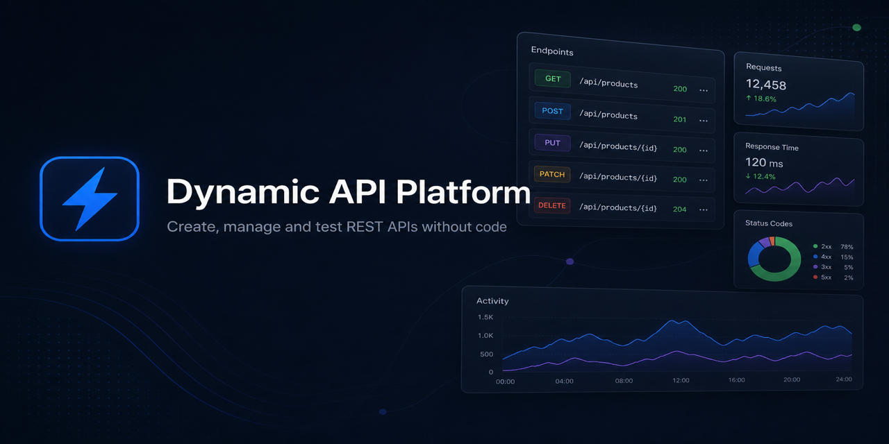
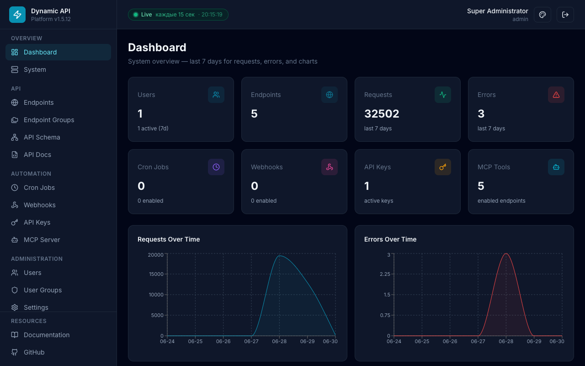

<p align="center">
  
</p>

# Dynamic API Platform

**Open-source platform for creating, managing, and testing REST APIs without writing backend code.**

[](https://github.com/Dynamic-API-Platform/Dynamic-API-Platform/releases/tag/v1.5.13)
[](LICENSE)
[](docker-compose.yml)
[](k8s/)
[](backend/package.json)
[](frontend/package.json)

<p align="center">
  <div style="font-family: -apple-system, BlinkMacSystemFont, 'Segoe UI', Roboto, 'Helvetica Neue', Arial, sans-serif; border: 1px solid rgb(224, 224, 224); border-radius: 12px; padding: 20px; max-width: 500px; background: rgb(255, 255, 255); box-shadow: rgba(0, 0, 0, 0.05) 0px 2px 8px; display: inline-block; text-align: left;">
    <div style="display: flex; align-items: center; gap: 12px; margin-bottom: 12px;">
      
      <div style="flex: 1 1 0%; min-width: 0px;">
        <h3 style="margin: 0px; font-size: 18px; font-weight: 600; color: rgb(26, 26, 26); line-height: 1.3; overflow: hidden; text-overflow: ellipsis; white-space: nowrap;">Dynamic API Platform</h3>
        <p style="margin: 4px 0px 0px; font-size: 14px; color: rgb(102, 102, 102); line-height: 1.4; overflow: hidden; text-overflow: ellipsis; display: -webkit-box; -webkit-line-clamp: 2; -webkit-box-orient: vertical;">Open-source dynamic REST API platform</p>
      </div>
    </div>
    <a href="https://www.producthunt.com/products/dynamic-api-platform?embed=true&utm_source=embed&utm_medium=post_embed" target="_blank" rel="noopener" style="display: inline-flex; align-items: center; gap: 4px; margin-top: 12px; padding: 8px 16px; background: rgb(255, 97, 84); color: rgb(255, 255, 255); text-decoration: none; border-radius: 8px; font-size: 14px; font-weight: 600;">Check it out on Product Hunt →</a>
  </div>
</p>

[Documentation](https://dynamic-api-platform.github.io/Dynamic-API-Platform/) · [Wiki](https://github.com/Dynamic-API-Platform/Dynamic-API-Platform/wiki) · [Quick Start](#quick-start) · [Deployment](#deployment) · [Screenshots](#screenshots) · [Issues](https://github.com/Dynamic-API-Platform/Dynamic-API-Platform/issues)

---

## Overview

Dynamic API Platform lets you define REST endpoints through a web admin panel, attach JSON schemas, configure access control, and serve data instantly — powered by MongoDB and a runtime API engine.

**New endpoints go live the moment you save them** — no server restart, no process reload, and no redeploy. Route definitions are stored in MongoDB and resolved on every request.

Perfect for prototyping, internal tools, lightweight BaaS, AI agent backends (MCP), and teams who need APIs fast without boilerplate.

### What makes it different

| | Dynamic API Platform | Typical CMS / custom backend |
|--|----------------------|------------------------------|
| Add a REST endpoint | Save in admin UI → immediately callable | Edit code → rebuild and/or restart |
| Change path or schema | Update in UI, takes effect instantly | Redeploy or restart workers |
| Server downtime | None for API changes | Often required |

## Quick Start

```bash
git clone https://github.com/Dynamic-API-Platform/Dynamic-API-Platform.git
cd Dynamic-API-Platform
docker compose up -d
```

| Service | URL |
|---------|-----|
| **Admin Panel** | http://localhost:8080 |
| **Backend API** | http://localhost:3001 |
| **Health Check** | http://localhost:3001/api/health |

**Default login:** `admin` / `Admin123!` — change immediately in production.

## Deployment

Three options — [full comparison](docs/deployment-variants.md):

| Variant | Command | Use case |
|---------|---------|----------|
| **1. Docker (single)** | `docker compose up -d` | Dev, demos, simple prod |
| **2. Docker replica set** | `docker compose -f docker-compose.replica.yml up -d` | HA MongoDB on Docker |
| **3. Kubernetes** | `./k8s/scripts/deploy.sh` | K8s cluster, scaled backend |

```bash
npm run docker:replica:up    # variant 2
npm run k8s:deploy           # variant 3
```

## Screenshots

<p align="center">
  
</p>

<p align="center">
  <a href="docs/screenshots.md">Full gallery</a> — login, endpoints, MCP, cron, webhooks, API keys, logs, settings, system
</p>

Regenerate from a running instance: `npm run screenshots`

## Features

### Dynamic API Engine
- REST endpoints (GET/POST/PUT/PATCH/DELETE) via UI — **live immediately**
- **`reference` fields** — foreign keys with `?populate=`
- **Data retention** — optional per-endpoint lifetime limit in days; leave empty to store records **forever**
- **Editable path** — change route path after creation; data migrates with the endpoint
- Schema builder, path params, validation, **network access** (domains / IP pools)
- Built-in API tester and OpenAPI / Swagger docs

### Automation & integrations
- **Cron jobs** — scheduled JavaScript, HTTP, or endpoint actions
- **Webhooks** — outbound events with optional HMAC
- **API keys** — machine-to-machine auth
- **MCP server** — expose endpoints as AI agent tools (`POST /api/mcp`, admin UI at `/mcp`)
- **JavaScript handlers** — custom `async function handler(req, db)` per endpoint
- **API versioning** — optional `/api/v1/...` paths

### Security
- JWT + refresh tokens, RBAC (5 system groups + custom)
- Network access rules, rate limiting, login lockout, audit logs
- Helmet (HSTS in production), CORS, CSRF, bcrypt
- Update settings: validated `githubRepo` format (`owner/repo` only, v1.5.10+)

### Admin Panel
- **Dashboard** — automation KPIs, request/error charts, health widget; **Live** auto-refresh in header
- Endpoints, groups, **API Schema** (ER diagram), **Database Explorer**
- Users, groups, **audit logs** with source filters
- **Four UI themes** — Dark, Light, Ocean, Forest — [docs/themes.md](docs/themes.md)
- **Live header badge** — polling on Dashboard/System, static data elsewhere — [docs/live-ui.md](docs/live-ui.md)
- System monitoring, settings (export/import)

### DevOps & software updates
- Docker Compose with **in-app updates enabled by default** (local PC or VPS)
- **Software updates** — GitHub release checks, **Update now**, scheduled auto-update, rollback — [docs/updates.md](docs/updates.md)
- **MongoDB replica set**, **Kubernetes** manifests
- Vitest unit tests (37), load test, GitHub Actions CI
- Health checks, persistent volumes, nginx API proxy
- [GitHub Pages](https://dynamic-api-platform.github.io/Dynamic-API-Platform/) docs + [Wiki](https://github.com/Dynamic-API-Platform/Dynamic-API-Platform/wiki)

## Example

```bash
TOKEN=$(curl -s -X POST http://localhost:3001/api/auth/login \
  -H "Content-Type: application/json" \
  -d '{"login":"admin","password":"Admin123!"}' | jq -r '.data.accessToken')

curl -X POST http://localhost:3001/api/products \
  -H "Authorization: Bearer $TOKEN" \
  -H "Content-Type: application/json" \
  -d '{"name":"Laptop","price":999}'
```

## Documentation

| Document | Description |
|----------|-------------|
| [Getting Started](docs/getting-started.md) | Installation and first endpoint |
| [Deployment Variants](docs/deployment-variants.md) | Docker / replica set / Kubernetes |
| [Architecture](docs/architecture.md) | System design and data flow |
| [Automation](docs/automation.md) | Cron, webhooks, MCP, API keys, handlers |
| [API Reference](docs/api-reference.md) | Management REST API |
| [Testing](docs/testing.md) | Unit tests, load test, CI |
| [Kubernetes](docs/kubernetes.md) | K8s deploy guide |
| [MongoDB Replica Set](docs/mongodb-replica-set.md) | 3-node Docker replica set |
| [Software Updates](docs/updates.md) | In-app updates from GitHub Releases |
| [FAQ](docs/faq.md) | Common questions |

**Online:** https://dynamic-api-platform.github.io/Dynamic-API-Platform/

## Project Structure

```
├── docker-compose.yml           # Variant 1 — single MongoDB
├── docker-compose.replica.yml   # Variant 2 — 3-node replica set
├── k8s/                         # Variant 3 — Kubernetes manifests
├── scripts/capture-screenshots.mjs
├── docs/                        # GitHub Pages documentation
├── wiki/                        # GitHub Wiki mirror
├── backend/src/                 # Express API, services, models
└── frontend/src/                # React admin panel
```

## Local Development

```bash
docker run -d -p 27017:27017 mongo:7
cd backend && npm install && npm run dev    # :3001
cd frontend && npm install && npm run dev   # :5173
```

See [Development Guide](docs/development.md).

## Testing

```bash
cd backend
npm test                 # Vitest — 38 tests, no MongoDB required
npm run test:load        # autocannon — backend must be running
```

CI runs `npm test` + build on every push. Details: [docs/testing.md](docs/testing.md).

## Environment Variables

| Variable | Default | Description |
|----------|---------|-------------|
| `JWT_SECRET` | *(change me)* | JWT signing secret |
| `MONGODB_URI` | `mongodb://mongodb:27017/dynamic_api` | DB URL (see `.env.example` for replica set) |
| `CORS_ORIGIN` | `http://localhost:8080` | Frontend origin |
| `ADMIN_LOGIN` / `ADMIN_PASSWORD` | `admin` / `Admin123!` | Seed admin |

Full list: [.env.example](.env.example)

## Contributing

See [CONTRIBUTING.md](CONTRIBUTING.md) and [CODE_OF_CONDUCT.md](CODE_OF_CONDUCT.md).

## Changelog

**[v1.5.13](https://github.com/Dynamic-API-Platform/Dynamic-API-Platform/releases/tag/v1.5.13)** (latest) — MCP auth, database clear collection, API version UI, login redesign.

**[v1.5.12](https://github.com/Dynamic-API-Platform/Dynamic-API-Platform/releases/tag/v1.5.12)** — Live header badge (auto-refresh + static data mode).

**[v1.5.11](https://github.com/Dynamic-API-Platform/Dynamic-API-Platform/releases/tag/v1.5.11)** — fix in-app Docker update host bind mounts.

**[v1.5.10](https://github.com/Dynamic-API-Platform/Dynamic-API-Platform/releases/tag/v1.5.10)** — security: `githubRepo` validation, HSTS, Referrer-Policy.

**[v1.5.9](https://github.com/Dynamic-API-Platform/Dynamic-API-Platform/releases/tag/v1.5.9)** — Ocean & Forest UI themes.

**[v1.5.7](https://github.com/Dynamic-API-Platform/Dynamic-API-Platform/releases/tag/v1.5.7)** — data retention (TTL), editable endpoint path.

**[v1.5.6](https://github.com/Dynamic-API-Platform/Dynamic-API-Platform/releases/tag/v1.5.6)** — docs, GitHub Pages, wiki, and org profile synced.

**[v1.5.5](https://github.com/Dynamic-API-Platform/Dynamic-API-Platform/releases/tag/v1.5.5)** — fix stuck update jobs, updater bash crash, cancel button.

**[v1.5.3](https://github.com/Dynamic-API-Platform/Dynamic-API-Platform/releases/tag/v1.5.3)** — fix update snapshot hang, correct version on System page.

**[v1.5.2](https://github.com/Dynamic-API-Platform/Dynamic-API-Platform/releases/tag/v1.5.2)** — auto-update out of the box in Docker, Update now button, archive deploy support.

**[v1.5.1](https://github.com/Dynamic-API-Platform/Dynamic-API-Platform/releases/tag/v1.5.1)** — hotfix: startup seed for update settings.

**[v1.5.0](https://github.com/Dynamic-API-Platform/Dynamic-API-Platform/releases/tag/v1.5.0)** — in-app software updates (GitHub releases, notifications, optional auto-update with rollback).

**[v1.4.0](https://github.com/Dynamic-API-Platform/Dynamic-API-Platform/releases/tag/v1.4.0)** — deployment variants (Docker replica set, K8s), testing suite, dashboard automation observability, strict validation, refreshed screenshots.

Full history: [CHANGELOG.md](CHANGELOG.md)

## License

[Apache License 2.0](LICENSE) © 2026 Dynamic API Platform
