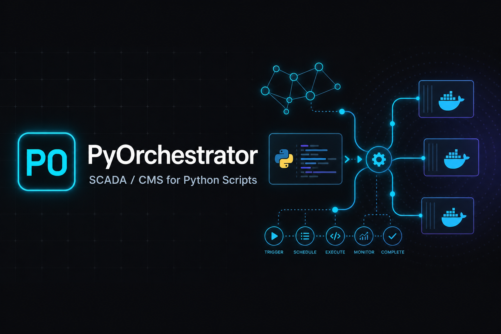

# PyOrchestrator



[](https://github.com/Developer-RU/pyorchestrator/actions/workflows/ci.yml)
[](https://github.com/Developer-RU/pyorchestrator/releases/tag/v0.1.0)
[](LICENSE)
[](https://developer-ru.github.io/pyorchestrator/)

**SCADA/CMS platform** for creating, scheduling, running, and monitoring thousands of isolated Python scripts and bots — inside a fixed Docker Compose stack.

> One Runtime Engine. Many sandboxes. Zero per-script containers.

**Документация:** https://developer-ru.github.io/pyorchestrator/

## Architecture

| Service | Description |
|---------|-------------|
| `backend` | FastAPI — REST, WebSocket, RBAC, secrets, backups |
| `frontend` | React + Tailwind + Monaco + Recharts — control plane UI |
| `runtime` | Python sandbox supervisor (subprocess + venv + rlimits) |
| `scheduler` | APScheduler — cron, intervals, webhooks |
| `postgres` | Metadata, runs, users, schedules |
| `redis` | Job queue, pub/sub, cache |
| `minio` | Script workspaces, assets, backups |
| `prometheus` + `grafana` + `loki` | Metrics & logs |
| `mcp` | MCP server for AI agents (port 8010) |

See [Architecture](https://developer-ru.github.io/pyorchestrator/architecture/) for full design.

### AI agents (MCP)

PyOrchestrator exposes an [MCP server](mcp/README.md) so Cursor and other agents can list scripts, run jobs, read logs, manage schedules and secrets. See [mcp/cursor-mcp.example.json](mcp/cursor-mcp.example.json) for Cursor setup.

## Quick Start

```bash
git clone https://github.com/Developer-RU/pyorchestrator.git
cd pyorchestrator
git checkout v0.1.0   # first stable release
cp .env.example .env
docker compose up --build
```

| URL | Service |
|-----|---------|
| http://localhost:5173 | Control Plane UI |
| http://localhost:8000/docs | API (Swagger) |
| http://localhost:8000/health | Health check |
| http://localhost:3000 | Grafana (admin/admin) |
| http://localhost:9090 | Prometheus |
| http://localhost:9001 | MinIO Console |
| http://localhost:8010/mcp | MCP server (streamable HTTP) |

**Default login:** `admin@pyorchestrator.local` / `admin` — change password and `.env` secrets before production.

## Project Structure

```
pyorchestrator/
├── backend/           # FastAPI application
│   └── app/
│       ├── api/v1/    # REST routers
│       ├── core/      # config, security
│       ├── models/    # SQLAlchemy ORM
│       ├── schemas/   # Pydantic DTOs
│       └── services/  # business logic + UpdateProvider
├── frontend/          # React + TypeScript + Vite + Tailwind
├── runtime/           # Sandbox engine
│   └── engine/
│       ├── sandbox.py # isolation layer
│       └── main.py    # Redis queue consumer
├── scheduler/         # APScheduler service
├── mcp/               # MCP server for AI agents
├── infrastructure/    # Prometheus, Grafana, Loki configs
├── docs/              # Documentation (GitHub Pages / Jekyll)
├── wiki/              # Copy for GitHub Wiki
├── docker-compose.yml
└── docker-compose.prod.yml
```

## Key Design Decisions

1. **No per-script containers** — all scripts run as isolated subprocess sandboxes inside `runtime`.
2. **Dynamic updates** — save script in UI → Redis event → runtime invalidates venv → no restart.
3. **Horizontal scale** — add `runtime` replicas sharing Redis queue (`docker-compose.prod.yml`).
4. **Secrets vault** — encrypted per-script; injected at run time, never in code.
5. **OTA updates** — abstract `UpdateProvider`; `GitHubUpdateProvider` stub ready.

## Documentation

| Topic | Link |
|-------|------|
| Release notes (v0.1.0) | [release-notes](https://developer-ru.github.io/pyorchestrator/release-notes/) |
| Quick start | [getting-started](https://developer-ru.github.io/pyorchestrator/getting-started/) |
| Architecture | [architecture](https://developer-ru.github.io/pyorchestrator/architecture/) |
| Control Plane UI | [control-plane](https://developer-ru.github.io/pyorchestrator/control-plane/) |
| Runtime & sandbox | [runtime](https://developer-ru.github.io/pyorchestrator/runtime/) |
| MCP for AI agents | [mcp](https://developer-ru.github.io/pyorchestrator/mcp/) |
| API reference | [api-reference](https://developer-ru.github.io/pyorchestrator/api-reference/) |
| Deployment | [deployment](https://developer-ru.github.io/pyorchestrator/deployment/) |
| Configuration | [configuration](https://developer-ru.github.io/pyorchestrator/configuration/) |
| Security | [security](https://developer-ru.github.io/pyorchestrator/security/) |
| Roadmap | [roadmap](https://developer-ru.github.io/pyorchestrator/roadmap/) |
| Troubleshooting | [troubleshooting](https://developer-ru.github.io/pyorchestrator/troubleshooting/) |

## Development Status

| Phase | Status |
|-------|--------|
| MVP-0 Foundation | ✅ Done |
| MVP-1 Script CRUD + Run | ✅ Done |
| MVP-2 Scheduler + Dashboard | ✅ Done |
| MVP-3 Editor + RBAC | ✅ Done |
| Production-1 Secrets + Backups | ✅ Done |
| Production-2 Scale + OTA | ✅ Stub ready |
| Production-3 Enterprise | 🔜 Backlog |

## Releases

| Version | Date | Notes |
|---------|------|-------|
| [v0.1.0](https://github.com/Developer-RU/pyorchestrator/releases/tag/v0.1.0) | 2026-06-27 | First public release — see [CHANGELOG.md](CHANGELOG.md) and [docs](https://developer-ru.github.io/pyorchestrator/release-notes/) |

## Contributing

See [CONTRIBUTING.md](CONTRIBUTING.md). Security issues: [SECURITY.md](SECURITY.md).

## License

[MIT](LICENSE)
