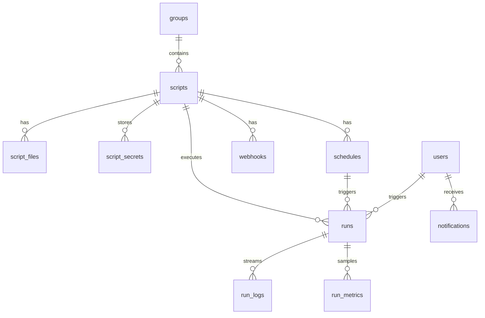

PostgreSQL 16. Первичные ключи UUID. Метки времени `created_at` / `updated_at` на сущностях.

> **Примечание:** полная ER-диаграмма в репозитории описывает целевую модель. В v0.1 RBAC реализован через enum-роли на `users.role`, без нормализованных таблиц `roles` / `permissions`.

## Основные таблицы (v0.1)

| Таблица | Назначение |
|---------|------------|
| `users` | Учётные записи, enum роли |
| `groups` | Группы скриптов |
| `scripts` | Метаданные скриптов/ботов |
| `script_files` | Исходники (content в БД + sync с MinIO) |
| `script_secrets` | Зашифрованные секреты |
| `script_templates` | Шаблоны |
| `schedules` | Cron / interval / webhook |
| `webhooks` | Входящие hooks |
| `runs` | История выполнений |
| `run_logs` | Строки логов |
| `run_metrics` | Сэмплы CPU/RAM |
| `notifications` | In-app оповещения |
| `notification_dismissals` | Скрытые оповещения |
| `backups` | Метаданные бэкапов |
| `backup_settings` | Настройки расписания |
| `audit_logs` | Журнал аудита |

## ER (упрощённо)

## Статусы run

`queued` → `running` → `success` | `failed` | `timeout` | `cancelled`

## Миграции

v0.1: `create_all()` при старте + `schema_patches.py` для hotfix FK.

Alembic — в [дорожной карте](/roadmap/).

## Полная спецификация

Исходник с детальными полями: [database-er.md](https://github.com/Developer-RU/pyorchestrator/blob/main/docs/database-er.md) в репозитории.
